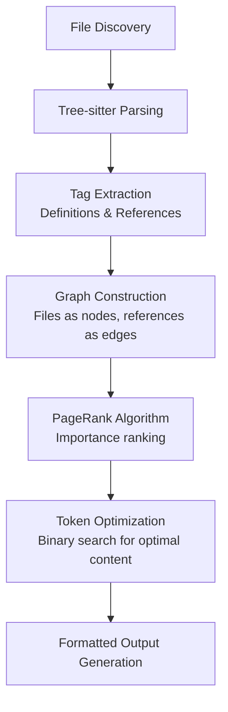

# RepoMapper MCP Tool Analysis - Findings Report

## Executive Summary

RepoMapper is a sophisticated Model Context Protocol (MCP) server and command-line tool designed to help AI language models understand and navigate complex codebases. It generates intelligent repository maps by analyzing code structure, relationships, and importance using advanced algorithms.

## Key Findings

### 1. Architecture Overview

The project consists of several core components:

- **`repomap_class.py`** (678 lines): Main implementation with the [`RepoMap`](repomap_class.py:41) class
- **`repomap_server.py`** (281 lines): MCP server implementation using FastMCP
- **`repomap.py`** (229 lines): Command-line interface
- **Supporting modules**: [`utils.py`](utils.py:1), [`scm.py`](scm.py:1), [`importance.py`](importance.py:1)

### 2. Core Functionality

#### 2.1 Code Analysis Pipeline


#### 2.2 Key Features
- **Multi-language Support**: 46+ programming languages via Tree-sitter
- **Smart Caching**: Persistent disk caching with automatic invalidation
- **Token Awareness**: Optimizes output for LLM context windows
- **Priority System**: Chat files > mentioned files > other files
- **Fallback Mechanisms**: Regex fallback when Tree-sitter fails

### 3. Technical Implementation Details

#### 3.1 Core Classes and Data Structures

**`RepoMap` Class** ([`repomap_class.py:41`](repomap_class.py:41)):
- Handles the entire repository mapping process
- Manages caching, token counting, and output generation
- Uses [`FileReport`](repomap_class.py:22) dataclass for processing statistics

**`Tag` NamedTuple** ([`repomap_class.py:38`](repomap_class.py:38)):
```python
Tag = namedtuple("Tag", "rel_fname fname line name kind".split())
```
- Stores parsed code definitions and references
- `kind` can be "def" (definition) or "ref" (reference)

#### 3.2 Algorithm Implementation

**PageRank Integration** ([`repomap_class.py:410`](repomap_class.py:410)):
```python
ranks = nx.pagerank(G, personalization=personalization, alpha=0.85)
```
- Uses NetworkX for graph algorithms
- Personalization vector for chat file prioritization
- Fallback to uniform ranking if PageRank fails

**Binary Search Optimization** ([`repomap_class.py:603`](repomap_class.py:603)):
- Finds optimal number of tags to fit within token limits
- Efficiently balances content richness vs. token constraints

### 4. MCP Server Capabilities

#### 4.1 Available Tools

**1. `repo_map` Tool** ([`repomap_server.py:38`](repomap_server.py:38)):
- Generates comprehensive repository maps
- Parameters: `project_root`, `chat_files`, `other_files`, `token_limit`, etc.
- Returns structured map with ranking information

**2. `search_identifiers` Tool** ([`repomap_server.py:162`](repomap_server.py:162)):
- Searches for specific code identifiers
- Supports case-insensitive matching
- Returns context-rich results with file locations

#### 4.2 Server Configuration
- Built on FastMCP framework
- STDIO communication protocol
- Configurable logging levels
- Automatic dependency management via [`run_server.sh`](run_server.sh:1)

### 5. Performance Analysis

#### 5.1 Caching Strategy
- **Cache Directory**: `.repomap.tags.cache.v1/`
- **Cache Key**: Based on file combinations and parameters
- **Invalidation**: Automatic based on file modification times
- **Fallback**: In-memory cache if disk cache fails

#### 5.2 Token Optimization
- **Sampling**: For long texts (>200 chars), uses statistical sampling
- **Model Support**: GPT-4, GPT-3.5-turbo, and other tiktoken-compatible models
- **Efficient Counting**: [`token_count()`](repomap_class.py:112) method with smart sampling

### 6. Language Support

The tool supports 46+ programming languages through Tree-sitter grammars, including:

- **Mainstream**: Python, JavaScript, TypeScript, Java, C/C++, Go, Rust
- **Web**: PHP, Ruby, Scala, Kotlin
- **Functional**: OCaml, Elixir, Elm, Common Lisp
- **Systems**: Swift, Solidarity, Dart
- **Config**: Properties, HCL, QL

### 7. Integration Capabilities

#### 7.1 With RooCode/CLine
```json
{
  "mcpServers": {
    "RepoMapper": {
      "command": "/absolute/path/to/run_server.sh",
      "type": "stdio"
    }
  }
}
```

#### 7.2 Standalone Usage
```bash
# Command-line interface
python repomap.py . --chat-files main.py --token-limit 4096

# MCP server
python repomap_server.py --debug
```

### 8. Strengths and Advantages

1. **Intelligent Ranking**: PageRank algorithm ensures most relevant content surfaces first
2. **LLM-Optimized**: Token-aware output generation perfect for AI context windows
3. **Comprehensive**: Handles complex codebases with multiple file types
4. **Extensible**: Easy to add new language support via SCM files
5. **Robust**: Multiple fallback mechanisms and error handling

### 9. Usage Recommendations

#### For AI Assistants:
1. **Initial Exploration**: Use `repo_map` without specific files for broad overview
2. **Focused Analysis**: Specify `chat_files` for targeted context
3. **Specific Queries**: Use `search_identifiers` for precise code location

#### For Developers:
1. **Integration**: Configure as MCP server for continuous access
2. **Customization**: Adjust token limits based on model capabilities
3. **Debugging**: Use `--verbose` and `--debug` flags for troubleshooting

### 10. Sample Output Analysis

From the test run:
- **Files Processed**: 66 total files considered
- **Definitions Found**: 23 definition matches
- **References Found**: 154 reference matches
- **Key File**: [`repomap_class.py`](repomap_class.py:23) with rank 0.0152

The output shows the most important files with their key components, providing AI models with crucial context for understanding codebase architecture.

## Conclusion

RepoMapper represents a sophisticated approach to codebase analysis and context generation for AI systems. Its combination of Tree-sitter parsing, PageRank ranking, and token-aware optimization makes it exceptionally well-suited for LLM integration. The dual-mode operation (CLI + MCP server) provides flexibility for different use cases, from standalone analysis to integrated AI assistant functionality.

The tool's architecture demonstrates careful consideration of performance, extensibility, and robustness, making it a valuable asset for any development team working with AI coding assistants.